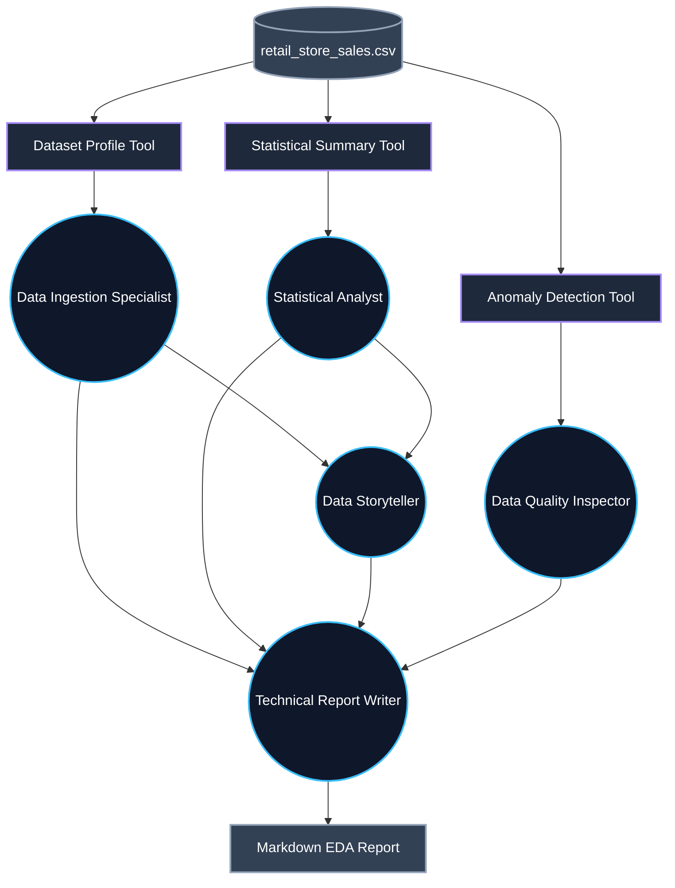

<div align="center">
  
# 🤖 Multi-Agent EDA Pipeline
**An Autonomous Data Analysis Workforce powered by CrewAI**

[](https://www.python.org/downloads/)
[](https://crewai.com)
[](https://pandas.pydata.org/)
[](https://opensource.org/licenses/MIT)

</div>

---

## 🚀 Overview

LLMs (even massive ones like Llama 3 70B or GPT-4) are notoriously bad at math and statistics. If you feed an LLM a raw CSV and ask for an analysis, it will frequently hallucinate numbers. 

To solve this, this pipeline **decouples computations from interpretation**. 

* 🧮 **Computations (Deterministic):** Handled entirely by strict Python tools using `pandas` and `numpy`.
* 🧠 **Interpretation (Heuristic):** Handled by the LLMs reading the strict text outputs generated by the pandas tools.

By enforcing strict Pydantic `BaseTool` schemas and using a sequence of 5 specialized AI agents, this pipeline guarantees **100% mathematical accuracy** while still delivering human-like business insights.

---

## 🏗️ The 5-Agent Architecture

To prevent a single LLM from getting confused by too many instructions, the EDA process is broken down into five specialized roles:



### 🧑‍💻 The Crew:
1. **Data Ingestion Specialist:** Loads the CSV and generates a high-level profile (rows, columns, data types).
2. **Statistical Analyst:** Computes numerical summaries (mean, median, std) and correlation matrices.
3. **Data Storyteller:** Translates the raw statistics into readable business interpretations.
4. **Data Quality Inspector:** Scans for anomalies, Z-score outliers, and IQR violations.
5. **Technical Report Writer:** Compiles all previous findings into a beautifully formatted Markdown report.

---

## ⚙️ Setup & Installation

**1. Clone the repository:**
```bash
git clone https://github.com/yourusername/multi-agent-eda.git
cd multi-agent-eda
```

**2. Install dependencies:**
```bash
pip install -r requirements.txt
```

**3. Environment Variables:**
Copy the example environment file and add your API keys:
```bash
cp .env.example .env
```
> **Note:** By default, the project is configured to use OpenAI's premium models (e.g., `gpt-4o`). 

---

## 🏃‍♂️ Running the Pipeline

Simply drop your dataset into the root directory (the default is `retail_store_sales.csv`) and execute:

```bash
python main.py
```

🎉 The final generated report will be saved inside the `outputs/` folder!

---

## 💡 Free-Tier & Local SLM Notes

If you are following the tutorial and wish to use **Groq's Free Tier**, you must adjust the pipeline to prevent rate limiting and schema rejection:

* **Update LLM:** In `agents.py`, change `DEFAULT_LLM` to `"groq/llama-3.3-70b-versatile"`.
* **Fix Caching:** In `agents.py`, uncomment the `litellm.drop_params = True` lines to prevent Groq from rejecting CrewAI's hidden cache parameters.
* **Throttle Agents:** In `main.py`, uncomment `max_rpm=1` inside the `Crew()` instantiation. This enforces a 60-second cooldown between agent tasks, ensuring you don't breach free-tier Tokens-Per-Minute (TPM) limits.

> ⚠️ **Note on Local SLMs (Ollama):** Small local models (like `phi3:mini` or `llama3.2:3b`) frequently struggle with strict JSON tool-calling and autonomous ReAct prompting loops. It is highly recommended to use a 70B+ model or GPT-4 class model for this architecture to prevent hallucinations.
