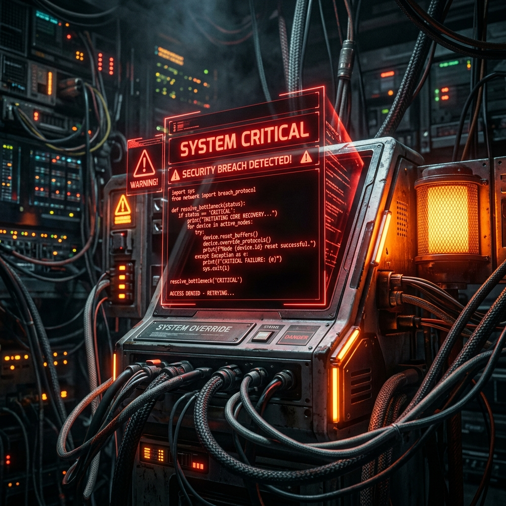

# Building a Bulletproof Multi-Agent Data Analyst with CrewAI (and Why Small LLMs Fail at It)

To test the true limits of AI agents, I grabbed a notoriously messy "Retail Store Sales" dataset from Kaggle. It was riddled with hidden outliers, missing categorical data, and 12,500 rows of transactional history. 

My goal was simple: Build an autonomous AI workforce that could ingest the raw CSV, perform complex Exploratory Data Analysis (EDA), and write a polished Markdown report, all without human intervention.

**The catch:** You cannot simply feed a 12,500-row CSV into an LLM. Not only will it instantly crash due to context window limitations, but Large Language Models are famously terrible at math. If you ask an LLM to calculate the standard deviation of 12,000 prices, it will confidently, eloquently lie to you. 

**The solution:** I built a 5-agent CrewAI pipeline. The secret to making it bulletproof? **Decoupling computation from interpretation.** Instead of letting the LLMs do the math, I built rigid Python scripts (`tools.py`) that use Pandas and Numpy to calculate the statistics perfectly. The agents never see the raw data; they only see the mathematically perfect metadata generated by Pandas, and their only job is to interpret it.

Here is how I built a production-ready AI Data Analyst, the engineering hurdles I had to overcome, and why attempting to do this with small local models ended in absolute disaster.

---

## The 5-Agent Architecture

To prevent a single LLM from getting confused by too many instructions, I broke the EDA process down into five specialized roles:

1. **The Data Ingestion Specialist:** Runs a custom python tool to extract lightweight metadata: column names, data types, missing value percentages, and 5 unique sample values per column.
2. **The Statistical Analyst:** Runs a statistical tool to compute deterministic numerical summaries (mean, median, standard deviation) and Pearson correlation matrices.
3. **The Data Storyteller:** Reads the output of the first two agents and translates the raw numbers into human-readable business insights.
4. **The Data Quality Inspector:** Runs an anomaly detection tool that mathematically flags Z-score outliers (>3 std), IQR violations, and suspicious placeholder strings.
5. **The Technical Report Writer:** Takes the combined knowledge of the entire crew and formats it into a final, stunning Markdown report.

---

## The Real-World Engineering Hurdles

Building the theoretical architecture was easy. Making it survive the real world was incredibly difficult. Here are the hurdles I had to overcome to stabilize the pipeline:

### 1. The Strict JSON Schema Rejection
When using high-speed APIs like Groq (running Llama 3 70B), the LLM kept crashing with a `tool_use_failed` error. The issue? CrewAI’s default function decorators use flexible `**kwargs`. Groq’s strict API validator physically rejected the LLM’s tool calls because the JSON schema was ambiguous. 
**The Fix:** I had to scrap the decorators and migrate the tools to strict `BaseTool` classes using Pydantic `BaseModel` schemas. By rigidly defining `file_path: str`, the schema perfectly matched the LLM's output, and the API rejections disappeared.

### 2. The Infinite "Go Ahead" Hallucination Loop
Agentic frameworks use a "ReAct" (Reason + Act) loop. Sometimes, an agent would realize it had all the data it needed, but instead of finishing the task, it would hallucinate a conversational filler like *"Go ahead"* and get stuck in an infinite loop waiting for a response.
**The Fix:** Aggressive negative prompting. I had to explicitly inject: *"Call the tool EXACTLY ONCE. DO NOT output conversational filler. DO NOT call the tool again."* Furthermore, I hardcapped all agents with `max_iter=3` to physically force them to stop thinking and start writing.

### 3. API Rate Limit Exhaustion
Five agents thinking, calling tools, and writing reports back-to-back will instantly blow past the Tokens-Per-Minute (TPM) limits on free API tiers, crashing the entire script halfway through the analysis.
**The Fix:** I injected a `max_rpm=1` parameter into the CrewAI orchestrator. This acted as a throttle, forcing the pipeline to pause for 60 seconds between tasks, allowing the API token buckets to reset. 

But dealing with API rate limits and sending sensitive company data to external cloud providers isn't always viable for real-world enterprise workflows. This naturally led me to the next logical step: trying to run the entire pipeline locally.

---

## The Local SLM Reality Check (Ollama)

With the pipeline running flawlessly on premium cloud models (like OpenAI's GPT-4o and Groq's Llama-3-70B), I wanted to test the holy grail of enterprise AI: **Data Privacy**. 

What if we pointed the exact same CrewAI script at a local Small Language Model (SLM) running via Ollama? If the data never leaves my laptop, it's perfectly secure. 

I tested Microsoft's `phi3:mini` and Meta's `llama3.2:3b`. The results were hilariously catastrophic.

* **`phi3:mini` physically rejected the API:** Small models are rarely fine-tuned for native tool-calling. When CrewAI sent the tool schema, the Ollama API blocked it entirely. Falling back to raw text prompting, the model hallucinated the file name, attempting to load `retail_storeclothing_sales.csv` (a file that doesn't exist). Our Python error-handling caught it gracefully, but the agent was dead in the water.
* **`llama3.2:3b` completely hallucinated the data:** The 3B model pretended to work. It generated a beautifully formatted markdown report. The only problem? It didn't use the Python tools at all. It looked at the prompt *"Write an EDA report for a sales dataset"*, completely forgot its instructions, and invented a fake 100-row dataset about selling iPhones and Sofas out of its own training weights!

## Conclusion

Automating Exploratory Data Analysis is entirely possible, but you cannot cut corners on the reasoning engine. 

For autonomous, multi-step agent frameworks where the AI has to reason, strictly format JSON tool calls, read complex statistical outputs, and summarize findings without hallucinating, this pattern proved highly demanding. For this specific pattern (multi-step ReAct loop with strict tool-calling), models below ~30B struggled in my testing as of mid-2026. 

**While my previous research proved that small 3B parameter models are fantastic at single-shot data formatting, this experiment establishes their exact boundary:** they currently lack the attention span required for complex, autonomous tool-calling workflows.

By decoupling the deterministic math (Python/Pandas) from the heuristics (LLM interpretation) and utilizing robust Pydantic schemas, you can build an AI workforce that delivers flawless, mathematically accurate insights every single time.
